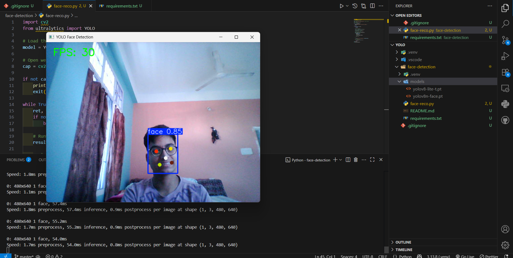

# 👤 YOLO Face Detection

This project performs **real-time face detection** using a webcam and a YOLOv8-face model.  
Frames are processed live, detections are drawn on-screen, and FPS information is displayed.

---

## 🚀 How It Works

The script:

1. Loads the YOLO face model from `../models/yolov8n-face.pt`.
2. Opens the webcam using OpenCV.
3. Feeds each frame into YOLO for inference.
4. Draws bounding boxes around detected faces.
5. Displays the annotated stream in a window.

---

## ▶️ Running the Script

```bash
cd face-detection
python face-reco.py
```

---

## 📦 Model Required

Place this file inside:

```
../models/
```

### Download:

* YOLOv8n-face model:
  [https://drive.usercontent.google.com/u/0/uc?id=1qcr9DbgsX3ryrz2uU8w4Xm3cOrRywXqb&export=download](https://drive.usercontent.google.com/u/0/uc?id=1qcr9DbgsX3ryrz2uU8w4Xm3cOrRywXqb&export=download)
* Alternate link:
  [https://drive.usercontent.google.com/u/0/uc?id=1vFMGW8xtRVo9bfC9yJVWWGY7vVxbLh94&export=download](https://drive.usercontent.google.com/u/0/uc?id=1vFMGW8xtRVo9bfC9yJVWWGY7vVxbLh94&export=download)

---

## 🖥 Preview



---

## 📘 Code (For Reference)

```py
import cv2
from ultralytics import YOLO

model = YOLO("../models/yolov8n-face.pt")

cap = cv2.VideoCapture(0)
...
```

---

## ⚠️ Notes

* Webcam required.
* If your FPS is low, try using a smaller model or resizing frames.
* `.pt` models are ignored by git.
