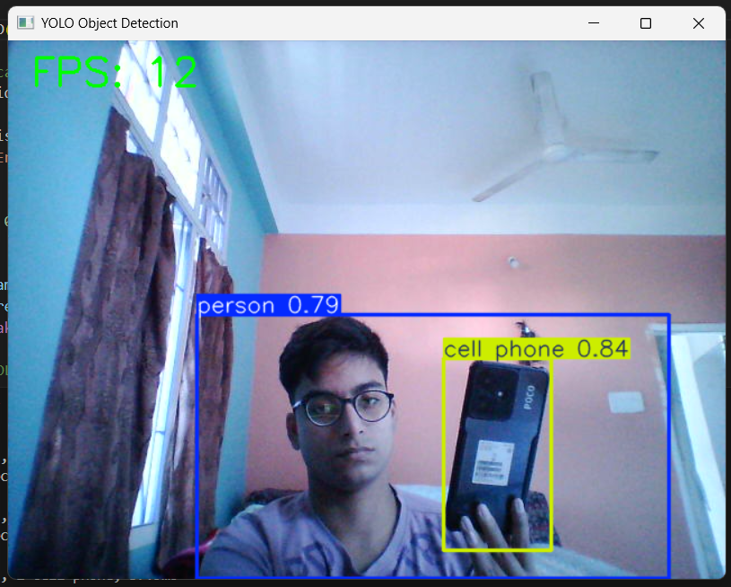

# 📦 YOLO Object Detection

This project demonstrates **real-time object detection** using YOLOv8 with a live webcam feed.

---

## 🚀 Features

- Real-time inference using OpenCV
- YOLOv8 model (nano or small)
- Live FPS counter
- Annotated output window with bounding boxes & labels

---

## ▶️ Running the Script

```bash
cd object-detection
python object_detect.py
````

---

## 📦 Required Models

Place models inside:

```
../models/
```

### Downloads:

* YOLOv8 nano:
  [https://github.com/ultralytics/assets/releases/download/v8.1.0/yolov8n.pt](https://github.com/ultralytics/assets/releases/download/v8.1.0/yolov8n.pt)
* YOLOv8 small (better accuracy):
  [https://huggingface.co/Ultralytics/YOLOv8/resolve/main/yolov8s.pt?download=true](https://huggingface.co/Ultralytics/YOLOv8/resolve/main/yolov8s.pt?download=true)

Update the script to use any model you prefer:

```py
model = YOLO("../models/yolov8n.pt")
```

---

## 🖼 Preview



---

## 📘 Code (For Reference)

```py
import cv2
from ultralytics import YOLO
import time

model = YOLO("../models/yolov8n.pt")
...
```

---

## ⚠️ Notes

* Webcam required.
* Large models give higher accuracy but lower FPS.
* Model files are ignored in this repo for size reasons.